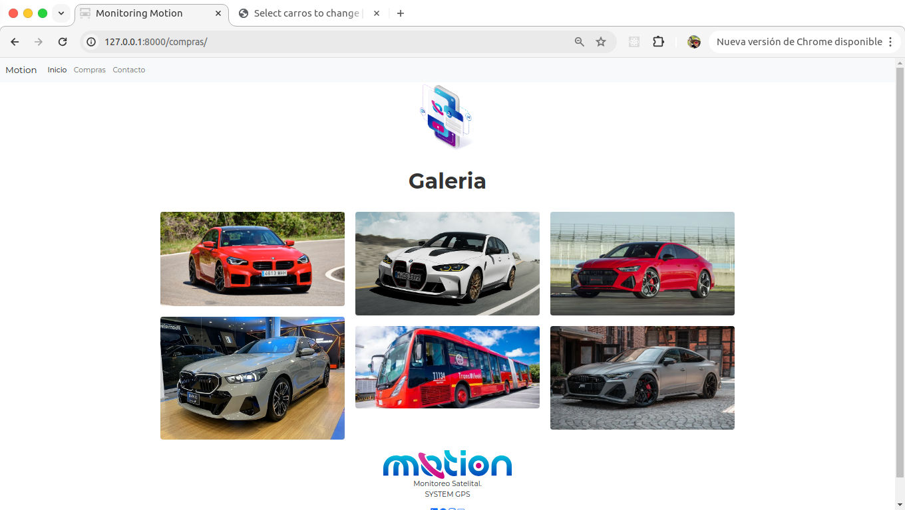

# Prueba Desarrollo Full Stack



## Monitoring Motion con Django
Este proyecto es una prueba de desarrollo Full Stack donde se implementan tecnologías como Python y JavaScript, utilizando el framework Django y Django Rest Framework para el backend. Se ha desarrollado una API para un sistema CRUD, integrado en una plantilla HTML diseñada para la parte visual e interactiva. Se utilizó Bootstrap para el diseño responsive, JavaScript para la interactividad adicional y CSS para estilos personalizados.


## Tecnologías utilizadas:
- Django: Framework web de alto nivel basado en Python, ideal para el desarrollo rápido y eficiente de aplicaciones web.
- Django Rest Framework: Potente y flexible framework para la construcción de APIs web.
- HTML: Lenguaje de marcado utilizado para definir la estructura y el contenido de la página web.
- CSS: Lenguaje de estilo para controlar el diseño y la presentación visual de la página web.
- JavaScript: Lenguaje de programación utilizado para mejorar la interactividad de la interfaz de usuario y la experiencia del usuario.
- Bootstrap: Framework de código abierto para diseño de sitios y aplicaciones web responsivas.
- MySQL: Sistema de gestión de bases de datos relacional utilizado para almacenar y administrar datos de la aplicación.

## Detalles del proyecto:
El proyecto incorpora un sistema CRUD completo utilizando Django y Django Rest Framework para gestionar datos de usuario. Además, se utilizó MySQL para la gestión de bases de datos, permitiendo administrar los datos desde la interfaz de administración de Django o directamente desde MySQL.

## Objetivos alcanzados:
- Implementación de una API RESTful con Django Rest Framework.
- Diseño y desarrollo de una interfaz de usuario con Bootstrap para una experiencia de usuario moderna y responsiva.
- Integración de estilos personalizados con CSS para una apariencia visual única.

## Instrucciones de instalación y ejecución:
- Clona este repositorio: 
```bash
git clone https://github.com/Bemontx/Monitoring_Innovation
```
- Instala las dependencias:
```bash
pip install -r requirements.txt
```
-Configura la base de datos en settings.py.

-Ejecuta las migraciones: python manage.py migrate

-Inicia el servidor de desarrollo: python manage.py runserver